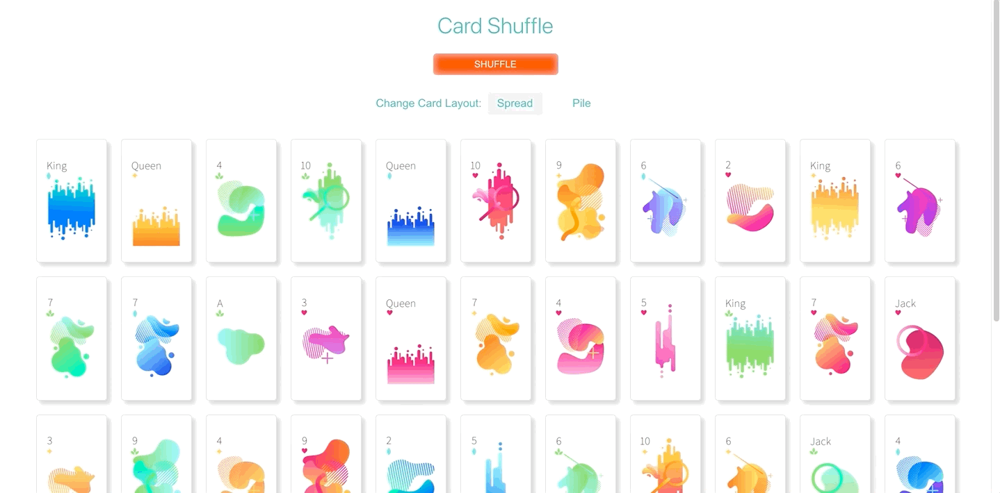
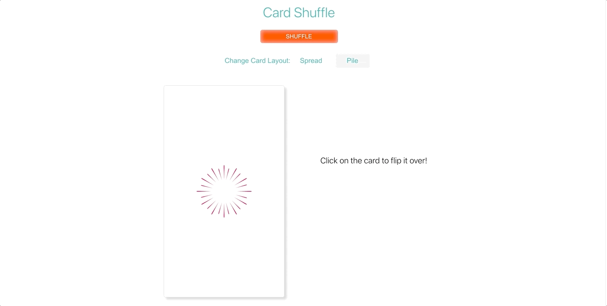

# Card Shuffle

Card Shuffle is an application that takes a deck of 52 cards and shuffles them on button click. The user can toggle between two card displays:
1) Spread out - cards start face up and the user can click on a card to flip it over.
2) Pile - cards are face down in a pile. The user can click on the top card to flip it over and then have access to the next card in the pile.

### Deployed on Netlify: 

View [deployed app](https://card-shuffle.netlify.app/)

## Setup
1. Clone this repository to your local machine
2. CD into this repo's directory
3. Run npm install to update dependencies
4. Run npm start
5. Visit http://localhost:3000/ in the browser (or whichever port is provided) to view it in the browser.
6. Optional: Run npm test to run test suite

## Technologies
- React
- JSX
- CSS
- React testing library
- Netlify
- git 
- GitHub

## Project in action:

### Application built by:
Steph Norton: [GitHub](https://github.com/NakiNorton) | [LinkedIn](https://www.linkedin.com/in/stephanie-norton-12888453/)  
